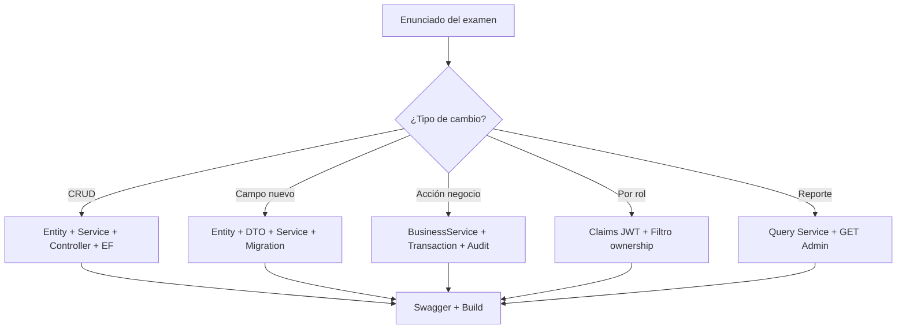

# Guía de modificaciones backend para examen

Documento de referencia basado en la arquitectura real de **AutoTallerManager-Backend**. Úsalo para clasificar el enunciado y saber qué archivos tocar en cada caso.

---

## 1. Cómo identificar el tipo de cambio

Antes de escribir código, clasifica la tarea:

| Tipo | Señales en el enunciado | Ejemplo en el proyecto |
|------|-------------------------|------------------------|
| **Nueva entidad CRUD** | "Crear catálogo de X", CRUD completo | `Genders`, `Suppliers`, `Parts` |
| **Campo nuevo** | "Agregar campo Y a Z" | `Plate` en `Vehicle` |
| **Acción de negocio** | cancelar, emitir, aprobar, registrar, cambiar estado | `CancelPurchaseAsync`, `GenerateFromServiceOrderAsync` |
| **Endpoint por rol** | "solo el cliente", "solo mecánico asignado" | `ClientApprovalsController`, `MechanicWorkflowController` |
| **Validación** | formato, unicidad, reglas | `VehicleService` (placa), `InvoiceBusiness` (factura duplicada) |
| **Relación entre entidades** | FK, navegación, "pertenece a" | `Vehicle` → `VehicleModel`, `PartPurchase` → `Supplier` |
| **Auditoría** | "registrar en auditoría", trazabilidad | `SupplierService`, `InventoryBusinessService` |
| **Catálogo** | lista de valores de referencia | `OrderStatuses`, `PaymentMethods` |
| **Reporte / consulta** | solo lectura, agregados, filtros por fecha | `ReportsController`, `AdminAuditQueriesController` |
| **Modificar flujo** | cambiar regla en proceso existente | impedir facturar orden cancelada |
| **Corregir bug** | comportamiento incorrecto en servicio existente | lógica en `ServiceExecutionService` |

---

## 2. Caso: Crear una nueva entidad CRUD

### Archivos que normalmente necesitas

| Capa | Archivo |
|------|---------|
| Domain | `Domain/Entities/NewEntity.cs` |
| Application | `Application/Features/NewEntities/Dtos/NewEntityDto.cs` |
| Application | `Application/Features/NewEntities/Requests/CreateNewEntityRequest.cs` |
| Application | `Application/Features/NewEntities/Requests/UpdateNewEntityRequest.cs` |
| Application | `Application/Features/NewEntities/Errors/NewEntityErrors.cs` |
| Application | `Application/Features/NewEntities/NewEntityService.cs` |
| Application | `Application/Features/NewEntities/INewEntityService.cs` |
| Api | `Api/Controllers/NewEntitiesController.cs` |
| Infrastructure | `Infrastructure/Persistence/Configurations/NewEntityConfiguration.cs` |
| Infrastructure | `AppDbContext.cs` → `DbSet<NewEntity>` |
| Infrastructure | Nueva migración EF |
| Opcional | Seeder en `Infrastructure/Persistence/Seeders/` |
| Opcional | Frontend (fuera del alcance del examen backend) |

### Pasos recomendados

1. **Entidad**: propiedades escalares + colecciones de navegación si hay relaciones.
2. **Errors**: al menos `NotFound`, errores de validación (`Required`, `TooLong`), `AlreadyExists`, `InUse` si aplica.
3. **Service**: métodos `GetAllAsync`, `GetByIdAsync`, `CreateAsync`, `UpdateAsync`, `DeleteAsync` devolviendo `Result<T>`.
4. **Validación en servicio**: normalizar texto (`Trim`), verificar longitudes, unicidad con `ExistsAsync`, FKs con `GetByIdAsync`.
5. **Persistencia**: `AddAsync` / `Update` / `Remove` + `SaveChangesAsync`.
6. **Controller**: heredar `BaseApiController`, `[Authorize(Roles = "...")]`, `FromResult`.
7. **EF**: configuración con tabla, clave, índices únicos, `HasMaxLength`.
8. **DI**: `services.AddScoped<INewEntityService, NewEntityService>()` en `DependencyInjection.cs`.

### Referencias según complejidad

| Complejidad | Copiar de |
|-------------|-----------|
| Catálogo simple | `Genders` (`GenderService`, `GendersController`) |
| CRUD con FKs y validación | `Vehicles` (`VehicleService`) |
| CRUD con auditoría en mutaciones | `Suppliers` (`SupplierService`) |

### Convenciones del proyecto

- Rutas: `api/{recurso-en-minuscula-plural}` → `api/vehicles`, `api/suppliers`.
- Códigos de error: `{Feature}.{Sufijo}` → `Vehicles.NotFound`.
- DELETE exitoso → `NoContent()` (204).
- POST exitoso → `CreatedAtAction` (201) con DTO.

---

## 3. Caso: Agregar un campo nuevo a una entidad existente

### Referencia principal: campo `Plate` en `Vehicle`

Archivos tocados en el proyecto real:

- `Domain/Entities/Vehicle.cs`
- `Application/Features/Vehicles/Dtos/VehicleDto.cs`
- `Application/Features/Vehicles/Requests/CreateVehicleRequest.cs`
- `Application/Features/Vehicles/Requests/UpdateVehicleRequest.cs`
- `Application/Features/Vehicles/VehicleService.cs` (normalización, regex, unicidad)
- `Application/Features/Vehicles/Errors/VehicleErrors.cs`
- `Infrastructure/Persistence/Configurations/VehicleConfiguration.cs`
- Migración `20260602170500_AddVehiclePlateColumn.cs`

### Pasos

1. Agregar propiedad en la entidad de dominio.
2. Agregar en DTO y requests (create/update).
3. En el servicio:
   - Leer y normalizar el valor.
   - Validar (requerido, longitud, formato).
   - Verificar unicidad si aplica (`ExistsAsync` excluyendo el id actual en update).
4. Mapear en `MapToDto`.
5. En configuración EF: `Property`, `HasMaxLength`, índice único si corresponde.
6. Agregar `DbSet` solo si la entidad es nueva (no aplica si solo es campo).
7. Crear migración y aplicarla.
8. Actualizar cuerpo de prueba en Swagger.

### Cuidado con datos existentes

Si el campo es **obligatorio** y ya hay filas, la migración puede necesitar un valor temporal (como en `AddVehiclePlateColumn` con `CONCAT('TMP', ...)`).

---

## 4. Caso: Agregar un endpoint de acción de negocio

Las acciones de negocio **no** siguen el CRUD estándar. Son operaciones con reglas, a veces transaccionales y auditadas.

### Ejemplos de acciones en el proyecto

| Acción | Servicio | Controller |
|--------|----------|------------|
| Cancelar compra | `InventoryBusinessService.CancelPurchaseAsync` | `POST api/inventory/purchases/{id}/cancel` |
| Registrar compra | `InventoryBusinessService.RegisterPurchaseAsync` | `POST api/inventory/register-purchase` |
| Emitir factura | `InvoiceBusinessService.GenerateFromServiceOrderAsync` | `InvoiceBusinessController` |
| Registrar pago | `PaymentBusinessService.RecordPaymentAsync` | `PaymentBusinessController` |
| Aprobar/rechazar servicio | `ClientApprovalService.ApproveOrderServiceAsync` | `ClientApprovalsController` |
| Actualizar trabajo realizado | `ServiceExecutionService.UpdateWorkPerformedAsync` | `MechanicWorkflowController` |
| Solicitar parte | `ServiceExecutionService` (request part) | `OrderServicePartBusinessController` |

### Archivos típicos

- `Requests/{Accion}Request.cs` si el body lleva datos (motivo de cancelación, monto, etc.).
- `Dtos/{Accion}ResultDto.cs` para la respuesta.
- `Errors/{Feature}Errors.cs` con sufijos `Conflict`, `Invalid`, `NotFound`.
- Método en servicio de negocio (`*BusinessService` o `*WorkflowService`).
- Endpoint en controller con verbo HTTP y ruta semántica.
- `IAuditLogger` si el enunciado pide trazabilidad.
- `ExecuteInTransactionAsync` si afecta varias tablas (stock + compra + detalle).

### Patrón del método de servicio

```csharp
// 1. Validar ids y request
// 2. Cargar entidades
// 3. Verificar reglas de negocio → return Failure si no cumple
// 4. ExecuteInTransactionAsync:
//    - mutar entidades
//    - SaveChangesAsync
//    - auditLogger.LogAsync(...)
//    - SaveChangesAsync (segundo guardado para auditoría)
// 5. return Success(dto)
```

### Controller

- Extraer `currentUserId` del claim `userId` (no del body).
- Pasar al servicio como parámetro separado.
- `[Authorize(Roles = "...")]` según quién puede ejecutar la acción.

---

## 5. Caso: Agregar feature con alcance por rol

### Claims del JWT (`JwtTokenGenerator.cs`)

| Claim | Uso |
|-------|-----|
| `userId` | Usuario que ejecuta la acción (auditoría, pagos) |
| `personId` | Persona asociada (cliente, mecánico) |
| `email` | Información de cuenta |
| `ClaimTypes.Role` | Admin, Receptionist, Mechanic, Client |

### Reglas importantes

1. **Nunca** aceptar `userId` o `personId` del body para autorización.
2. Extraer en el controller con `User.FindFirstValue("userId")` / `"personId"`.
3. Si el claim falta o es inválido → `return Unauthorized()`.
4. Filtrar datos en el servicio por propiedad o asignación.

### Ejemplos

| Escenario | Referencia |
|-----------|------------|
| Cliente ve solo sus vehículos | `ClientVehiclesController` → `GET api/client/my-vehicles` usa `personId` del token |
| Cliente aprueba solo sus órdenes | `ClientApprovalService` valida ownership vía `VehicleOwnerHistory` |
| Mecánico solo servicios asignados | `ServiceExecutionService.GetMyAssignedServicesAsync(personId)` |
| Solo Admin cancela compra | `[Authorize(Roles = "Admin")]` en `InventoryBusinessController.CancelPurchase` |

### Errores de acceso

- Sin rol → 401/403 desde ASP.NET.
- Recurso de otro cliente → `ClientCannotAccessServiceOrderConflict` (409) en `ServiceExecutionErrors`.
- Mecánico no asignado → `MechanicNotAssignedConflict` (409).

---

## 6. Caso: Agregar auditoría a un flujo

### Cuándo auditar

- Crear, actualizar o eliminar entidades sensibles (`SupplierService`).
- Acciones de negocio relevantes (compra, cancelación, factura, pago, aprobación).
- Cuando el enunciado lo pida explícitamente.

### Cómo usar `IAuditLogger`

```csharp
await _auditLogger.LogAsync(
    currentUserId,
    "UPDATE",              // nombre del AuditActionType (CREATE, UPDATE, DELETE, CANCEL, ...)
    "Supplier",            // entidad afectada (texto)
    supplier.SupplierId,   // id del registro
    "Descripción breve",   // sin datos sensibles
    cancellationToken);
```

### Datos a incluir / evitar

| Incluir | Evitar |
|---------|--------|
| Id de entidad, tipo de acción | Contraseñas, tokens |
| Resumen de la operación | Números de tarjeta completos |
| Referencia de negocio | Datos personales innecesarios |

### Patrón de persistencia

`AuditLogger` hace `AddAsync` al repositorio de `Audit` pero **no** llama `SaveChanges` directamente. El servicio debe:

1. Mutar datos de negocio.
2. `SaveChangesAsync`.
3. `LogAsync`.
4. `SaveChangesAsync` otra vez (dentro de la misma transacción si usas `ExecuteInTransactionAsync`).

### API de auditoría es solo lectura

- `AuditsController`: GET lista y por id.
- `AdminAuditQueriesController`: consultas filtradas.
- No crear endpoints POST para insertar auditorías manualmente.

### Tipos de acción

Deben existir en tabla `AuditActionTypes` (seeded). Nombres usados en código: `CREATE`, `UPDATE`, `DELETE`, `CANCEL`.

---

## 7. Caso: Agregar o actualizar validación

### Dónde valida el proyecto

| Nivel | Responsabilidad |
|-------|-----------------|
| **Request** | Solo transporte de datos (propiedades nullable en create) |
| **Service** | Validación principal: normalización, reglas, unicidad, FK |
| **Entidad** | Sin atributos de validación (dominio limpio) |
| **EF Configuration** | `IsRequired`, `HasMaxLength`, índices únicos |
| **Result/Error** | Respuesta uniforme al controller |

### Mapeo HTTP (`BaseApiController`)

| Sufijo en `Error.Code` | HTTP |
|------------------------|------|
| `NotFound` | 404 |
| `Required`, `Invalid`, `TooLong`, `Validation`, ... | 400 |
| `AlreadyExists`, `Conflict`, `InUse` | 409 |
| `Forbidden` | 403 |

### Ejemplos reales

| Regla | Dónde |
|-------|-------|
| Placa de vehículo | `VehicleService.Validate`, regex `PlatePattern` |
| Compra ya cancelada | `InventoryBusinessErrors.PurchaseAlreadyCancelledConflict` |
| Factura duplicada por orden | `InvoiceBusinessErrors.ServiceOrderAlreadyHasInvoiceConflict` |
| Cliente sin acceso a orden | `ServiceExecutionErrors.ClientCannotAccessServiceOrderConflict` |
| Mecánico no asignado | `ServiceExecutionErrors.MechanicNotAssignedConflict` |

### Convención de nombres de error

- Validación de entrada: `...Required`, `...Invalid`, `...TooLong`.
- Estado de negocio: `...Conflict`.
- Recurso en uso al eliminar: `InUse`.

---

## 8. Caso: Agregar relación entre entidades

### Pasos

1. **Domain**: FK (`int OtherEntityId`) + propiedad de navegación (`public OtherEntity Other { get; set; }`).
2. **Configuration EF**:
   ```csharp
   builder.HasOne(x => x.Other)
       .WithMany(x => x.NewEntities)
       .HasForeignKey(x => x.OtherEntityId)
       .OnDelete(DeleteBehavior.Restrict); // habitual en el proyecto
   ```
3. **Service**: verificar que `OtherEntityId` existe antes de crear/actualizar.
4. **Migración**: FK e índice.
5. **Swagger**: probar create con FK válida e inválida.

### Referencias

- `Vehicle` → `VehicleModel`, `VehicleType`
- `PartPurchase` → `Supplier`
- `OrderService` → `ServiceOrder`, `ServiceType`

---

## 9. Caso: Agregar reporte o endpoint de consulta (solo lectura)

### Características

- Solo métodos **GET**.
- Sin `AddAsync`, `Update`, `Remove`.
- DTO de salida específico (no exponer entidades).
- Autorización restrictiva (casi siempre Admin).

### Referencias

| Tipo | Archivo |
|------|---------|
| Reportes con rango de fechas | `ReportsController`, `ReportService` |
| Auditoría reciente | `AdminAuditQueriesController.GetRecent` |
| Búsqueda con término | `SearchController`, `SearchService` |
| Dashboard por rol | `DashboardsController`, `DashboardService` |

### Filtros opcionales

```csharp
[HttpGet("sales")]
public async Task<IActionResult> GetSalesReport(
    [FromQuery] DateTime? from,
    [FromQuery] DateTime? to,
    CancellationToken cancellationToken)
```

En el servicio: aplicar `Where` solo si `from`/`to` tienen valor; devolver lista o agregado en DTO.

---

## 10. Caso: Corregir un bug en el backend

### Proceso seguro

1. **Reproducir en Swagger** con datos concretos; anotar request y respuesta incorrecta.
2. **Localizar controller** por ruta (`api/...`).
3. **Ir al servicio** inyectado en el constructor.
4. **Revisar** qué `Error` devuelve o si la consulta EF filtra mal.
5. **Inspeccionar** `FindAsync`, `ExistsAsync`, condiciones `if` de negocio.
6. **Corregir el mínimo** necesario (una condición, un Include, un filtro por `personId`).
7. **`dotnet build`**.
8. **Retestar** caso que fallaba + caso feliz + caso límite.

### Errores frecuentes en examen

- Olvidar filtrar por `personId` del token.
- Usar `GetAllAsync` sin filtro cuando debe ser scoped.
- No excluir el id actual en validación de unicidad en UPDATE.
- Llamar `SaveChanges` fuera de transacción en operación multi-tabla.
- Código de error sin sufijo correcto → HTTP inesperado (500 en vez de 409).

---

## 11. Comandos útiles durante el examen

```bash
dotnet restore
dotnet build .\AutoTallerManager.slnx
dotnet ef migrations add Name --project Infrastructure\Infrastructure.csproj --startup-project Api\Api.csproj --context Infrastructure.Persistence.AppDbContext
dotnet ef database update --project Infrastructure\Infrastructure.csproj --startup-project Api\Api.csproj --context Infrastructure.Persistence.AppDbContext
dotnet run --project Api\Api.csproj
```

### Advertencias

- **Solo crea migración** si cambias el esquema de base de datos (entidad nueva, columna, FK, índice).
- **Detén la API** antes de `dotnet build` si aparece error de DLL bloqueado (el proceso en ejecución tiene el archivo abierto).
- **No ejecutes** `database update` en el examen si el profesor no lo indica; en preparación sí conviene practicarlo.

### Puerto y Swagger

- API: `http://localhost:5077`
- Swagger: `http://localhost:5077/swagger`
- Login: `POST /api/auth/login`

---

## Resumen visual del flujo por tipo


